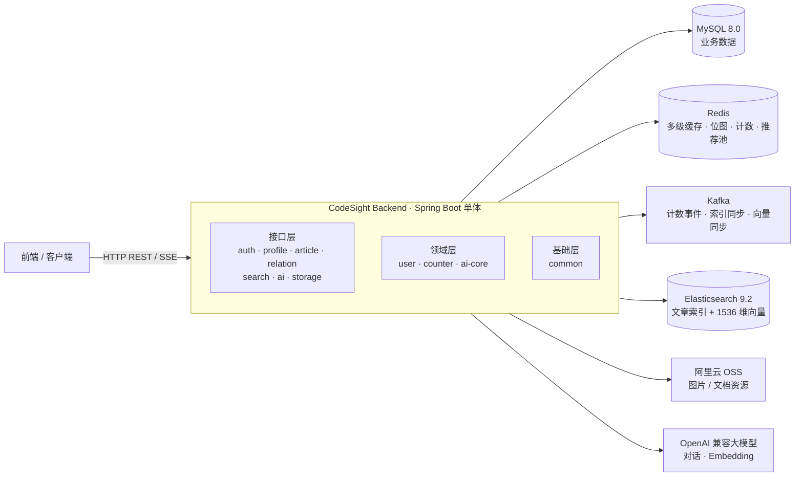
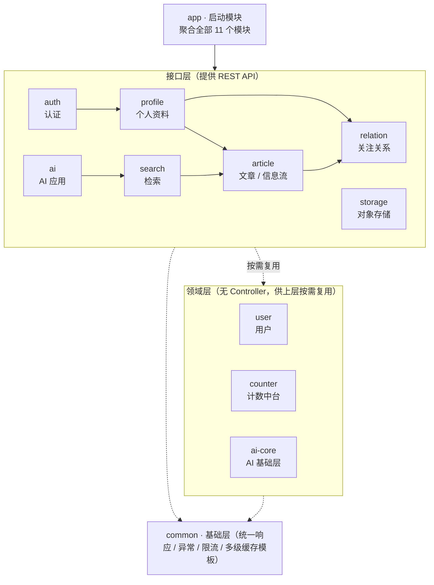

<div align="center">

# 码境 · CodeSight

        

</div>

---

## 目录

- [项目简介](#项目简介)
- [核心技术亮点](#核心技术亮点)
- [系统架构与模块分层](#系统架构与模块分层)
- [技术栈选型](#技术栈选型)
- [快速开始](#快速开始)
- [核心机制与深度设计](#核心机制与深度设计)
- [性能基准与压测](#性能基准与压测)
- [API 概览与接口文档](#api-概览与接口文档)
- [数据库与存储设计](#数据库与存储设计)
- [测试](#测试)
- [开源协议](#开源协议)

## 项目简介

码境（CodeSight）是一个基于 Java 21 与 Spring Boot 3.3.0 多模块单体架构的技术社区后端，支持 Markdown 文章创作与推荐/最新/关注三路信息流、点赞收藏与关注社交、全文检索与相关推荐，并内置文章伴读、智能追问与全站知识库 RAG 等 AI 问答能力。

## 核心技术亮点

- **安全认证与权限防护**：RS256 非对称私钥签名与公钥验签解耦；基于 Access/Refresh Token 双令牌体系与 Redis 白名单，刷新时执行 `jti` 轮转作废并严防重放攻击；结合 Lua 原子防爆破与账号/IP 双维度安全锁定。
- **三级缓存与防击穿体系**：设计通用 `MultiLevelCacheTemplate`（L1 Caffeine 8.66ms → L2 Redis 13.65ms → L3 MySQL）；通过 SingleFlight 将瞬时突发冷数据回源压缩为单次物理加载，辅以空值哨兵与 TTL 动态抖动立体防线。
- **自研紧凑计数中台**：设计 16 字节定长 SDS 计数快照与 4KB 分片位图原子翻转判重，经 Kafka 异步削峰聚合；支持业务 SPI 锁防击穿自愈，并具备基于事件溯源的 Kafka 灾难全量历史回放能力。
- **三种 Feed 流（推荐 / 最新 / 关注）**：全链路采用 Keyset 复合游标分页；**推荐流**构建全站 Redis ZSET Top-3000 动态候选池，串联曝光过滤与 AI 双向向量感知（余弦相似度 ≥0.85 负向语义剪枝 + 正向加权精排）；**关注流**引入**推拉结合架构**与大 V 粉丝双阈值（5500/4500）状态机平衡写放大与读延迟。
- **混合检索与 300ms 超时熔断**：BM25 + 向量 KNN 以 RRF（k=60）融合排序，Embedding 接口注入 300ms 严格超时断路器，超时自动平滑降级纯 BM25 检索，阻断慢依赖级联雪崩。
- **全链路 AI 问答应用**：基于 OpenAI 兼容协议构建单篇伴读流式问答（SSE）、智能追问推荐，以及全站知识库 RAG 问答（提问向量化 → ES KNN 召回 3 篇站内文档 → 带标题引用流式生成）。
- **统一向量资产沉淀与多场景复用**：文章发布/更新时一次性特征提取生成 1536 维密集向量，经 Kafka 异步沉淀为全局向量资产（Redis 内存层 + ES 向量索引）；支撑 **4 大业务场景全局复用**：① 推荐流负向语义剪枝与正向加权精排，② 相似文章 Top-5 KNN 推荐，③ BM25+KNN 混合检索，④ 全站知识库 RAG 引用问答。

## 系统架构与模块分层

### 运行时架构



### 模块依赖拓扑



**模块间完整依赖清单**（自各模块 `pom.xml` 的 `<dependencies>` 逐一提取）：

| 模块                                       | 直接依赖的内部模块                                  |
|--------------------------------------------|-----------------------------------------------------|
| `app`                                      | 其余全部 11 个模块                                  |
| `auth`                                     | `profile`、`user`                                   |
| `profile`                                  | `article`、`relation`、`storage`、`user`、`counter` |
| `article`                                  | `relation`、`storage`、`user`、`counter`、`ai-core` |
| `relation`                                 | `user`、`counter`                                   |
| `search`                                   | `article`、`user`、`counter`、`ai-core`             |
| `ai`                                       | `search`、`ai-core`                                 |
| `storage` / `user` / `counter` / `ai-core` | 无（仅依赖 `common`）                               |

### 模块职责

| 模块       | 类型      | 职责                                                                                                                                                                                               |
|------------|-----------|----------------------------------------------------------------------------------------------------------------------------------------------------------------------------------------------------|
| `app`      | 启动模块  | 唯一 Spring Boot 启动入口（`CodeSightApplication`），聚合全部模块；主配置 `application.yaml`、Knife4j/OpenAPI 配置、MyBatis-Plus 字段自动填充                                                      |
| `common`   | 基础库    | 统一响应 `Result`、全局异常处理、全局响应包装、`@RateLimit` 接口限流（Redis + Lua）、`@CurrentUserId` 参数解析、`ClientInfo` 客户端信息解析、`MultiLevelCacheTemplate` 多级缓存模板、Redisson 配置 |
| `user`     | 领域模块  | 用户领域模型与三级缓存用户画像（无 Controller）                                                                                                                                                    |
| `auth`     | 接口模块  | 注册/登录/登出/令牌刷新/重置密码、验证码、登录安全锁定、登录审计日志                                                                                                                               |
| `profile`  | 接口模块  | 个人资料维护、头像上传、创作者公开名片（虚拟线程并行聚合）、用户维度计数重建 SPI                                                                                                                   |
| `article`  | 接口模块  | 文章/分类/标签、信息流（推荐/最新/关注）、推荐排序池、Markdown 解析、文章计数重建 SPI                                                                                                              |
| `relation` | 接口模块  | 关注/粉丝、双向关系查询、Keyset 游标分页                                                                                                                                                           |
| `counter`  | 领域模块  | 通用计数中台：16B SDS 计数快照、分片位图判重、Kafka 削峰聚合、计数自愈重建 SPI（无 Controller、无库表）                                                                                            |
| `search`   | 接口模块  | Elasticsearch 全文检索、混合检索（BM25 + 向量 KNN/RRF）、相关文章推荐、RAG 知识召回（无库表）                                                                                                      |
| `ai-core`  | AI 基础层 | Embedding 向量化、文章向量与用户偏好画像（Redis 存储）、余弦相似度算子（无 Controller）                                                                                                            |
| `ai`       | AI 应用层 | 单篇文章伴读流式问答、智能追问推荐、全站知识库 RAG 流式问答（SSE）                                                                                                                                 |
| `storage`  | 接口模块  | 阿里云 OSS 预签名直传（无库表）                                                                                                                                                                    |

### 目录结构

```
codesight_backend
├── db/                          # MySQL 建表脚本（4 个，含初始数据）
├── docker-compose.yml           # MySQL / Kafka / Redis / Elasticsearch
├── pom.xml                      # 父 POM（聚合 12 个模块，统一依赖版本）
├── app/                         # 启动模块（application.yaml、Knife4j、MP 填充器）
├── common/                      # 统一响应/异常/限流/多级缓存模板
├── user/                        # 用户领域与画像缓存
├── auth/                        # 认证（JWT/验证码/登录安全/审计）+ keys/（RSA 密钥，不入库）
├── profile/                     # 个人资料/头像/创作者名片
├── counter/                     # 计数中台（16B SDS/位图分片/Kafka 聚合）
├── article/                     # 文章/信息流/推荐池（含 mapper XML 与衰减 Lua）
├── relation/                    # 关注关系与游标分页
├── search/                      # ES 索引/检索/相关推荐/RAG 召回
├── ai-core/                     # AI 基础层（Embedding/向量资产/余弦算子）
├── ai/                          # AI 应用层（伴读/追问/RAG，SSE）
└── storage/                     # 阿里云 OSS 预签名直传
```

## 技术栈选型

| 分类     | 技术                                                                               |
|----------|------------------------------------------------------------------------------------|
| 基础框架 | Java 21、Spring Boot 3.3.0（Web / Security / OAuth2 Resource Server / Validation） |
| ORM      | MyBatis-Plus 3.5.16 + MySQL 8.0                                                    |
| 缓存     | Redis（Redisson 3.52.0 + Spring Data Redis）、Caffeine 本地缓存                    |
| 消息队列 | Apache Kafka（spring-kafka，KRaft 单节点）                                         |
| 搜索     | Elasticsearch 9.2.1（elasticsearch-java 9.2.1）                                    |
| AI       | Spring AI 1.0.9（OpenAI 兼容协议的 ChatModel / EmbeddingModel）                    |
| 认证     | JWT RS256（Nimbus，经 spring-security-oauth2-resource-server）、BCrypt             |
| 对象存储 | 阿里云 OSS（alibabacloud-oss-v2 0.5.1，预签名直传）                                |
| 文档     | Knife4j 4.5.0（OpenAPI3）                                                          |
| 工具库   | Hutool 5.8.47、BouncyCastle 1.78.1、CommonMark 0.30.0、Lombok                      |

## 快速开始

### 环境要求

- JDK 21+、Maven 3.8+、Docker
- 一个 OpenAI 协议兼容的大模型接入点（对话模型 + 向量模型）
- 阿里云 OSS Bucket（用于文章图片与用户头像存储）

### 1. 启动基础设施

```bash
docker compose up -d
```

将启动 MySQL 8.0（端口 3306，root 密码默认 `123456`，库 `codesight`）、Kafka（9092）、Redis（6379）、Elasticsearch 9.2.1（9200，已关闭安全认证）。

### 2. 初始化数据库

`docker-compose.yml` 已将 `./db` 挂载为 MySQL 初始化目录（`/docker-entrypoint-initdb.d`），包含 4 个脚本：

| 脚本           | 内容                                                                                             |
|----------------|--------------------------------------------------------------------------------------------------|
| `user.sql`     | `users` 用户表                                                                                   |
| `auth.sql`     | `login_logs` 登录审计日志表                                                                      |
| `relation.sql` | `user_following` / `user_follower` 关注与粉丝表                                                  |
| `article.sql`  | `categories` / `tags` / `category_tag_rel` / `articles` / `article_tag_rel` 及分类、标签初始数据 |

### 3. 生成 JWT RSA 密钥

auth 模块从 `classpath:keys/private.pem` / `classpath:keys/public.pem` 加载 RS256 密钥对：

```bash
mkdir -p auth/src/main/resources/keys
openssl genpkey -algorithm RSA -pkeyopt rsa_keygen_bits:2048 -out auth/src/main/resources/keys/private.pem
openssl rsa -in auth/src/main/resources/keys/private.pem -pubout -out auth/src/main/resources/keys/public.pem
```

### 4. 配置说明

**环境变量**（在启动应用前设置）：

| 变量                                           | 说明                        | 默认值                             |
|------------------------------------------------|-----------------------------|------------------------------------|
| `MYSQL_HOST` / `MYSQL_PORT` / `MYSQL_DATABASE` | MySQL 地址                  | `localhost` / `3306` / `codesight` |
| `MYSQL_USERNAME` / `MYSQL_PASSWORD`            | MySQL 凭证                  | `root` / `123456`                  |
| `ES_URI`                                       | Elasticsearch 地址          | `http://localhost:9200`            |
| `ES_USERNAME` / `ES_PASSWORD`                  | ES 认证凭证                 | 无默认值，**必须设置**             |
| `OPENAI_BASE_URL` / `OPENAI_API_KEY`           | OpenAI 兼容接入点地址与密钥 | 必填                               |
| `OPENAI_CHAT_MODEL` / `OPENAI_EMBEDDING_MODEL` | 对话模型 / 向量模型名       | 必填                               |
| `OSS_ACCESS_KEY_ID` / `OSS_ACCESS_KEY_SECRET`  | 阿里云 OSS 凭证             | 必填                               |

```bash
export ES_USERNAME="" ES_PASSWORD=""
export OPENAI_BASE_URL="https://your-endpoint" OPENAI_API_KEY="sk-xxx"
export OPENAI_CHAT_MODEL="your-chat-model" OPENAI_EMBEDDING_MODEL="your-embedding-model"
export OSS_ACCESS_KEY_ID="xxx" OSS_ACCESS_KEY_SECRET="xxx"
```

**配置文件索引**（主配置通过 `spring.profiles.include: auth, ai, search, article` 激活各模块 profile）：

| 文件                                      | 内容                                                                                                                                           |
|-------------------------------------------|------------------------------------------------------------------------------------------------------------------------------------------------|
| `app/src/main/resources/application.yaml` | 主配置：数据源、Redis、Kafka（手动 ack）、ES 连接、OSS 配置、大模型接入（Spring AI OpenAI）、MyBatis-Plus、虚拟线程、Caffeine 各缓存容量与 TTL |
| `auth/.../application-auth.yaml`          | JWT 签发者/密钥路径/TTL、验证码策略、密码策略、登录锁定阈值                                                                                    |
| `ai/.../application-ai.yaml`              | 推荐流语义剪枝与精排参数、偏好样本窗口大小                                                                                                     |
| `search/.../application-search.yaml`      | ES 索引名、向量维度（1536）、混合检索开关、Embedding 超时                                                                                      |
| `article/.../application-article.yaml`    | 信息流参数：大 V 晋升/降级阈值（5500/4500）、收件箱/发件箱/曝光容量与 TTL                                                                      |

**阿里云 OSS 控制台配置**（对象存储与前端直传正常运行的前提）：

需在阿里云控制台创建 Bucket（地域、Bucket 名称，需与 `app/src/main/resources/application.yaml` 中的 `oss` 配置对应），并在控制台完成以下设置：

1. **阻止公共访问**：**关闭**
2. **读写权限**：**公共读**
3. **跨域设置**：
   - 创建规则：
     - **来源**：`*`（本地）或前端实际部署域名；
     - **允许 Methods**：勾选 `PUT`, `GET`, `POST`, `HEAD`；
     - **允许 Headers**：`*`（放行前端传入的 `Content-Type` 等请求头）；
     - **暴露 Headers**：`ETag, x-oss-request-id`（前端据此获取 ETag 校验直传完整性）；
     - **缓存时间**：`3600`（缓存预检结果，降低 OPTIONS 请求频次）。

### 5. 构建与运行

```bash
mvn clean package -DskipTests
java -jar app/target/app-0.0.1-SNAPSHOT.jar
```

启动成功后访问 <http://localhost:8080/doc.html> 查看接口文档。

## 核心机制与深度设计

### 通用基础层（common）

全站各业务领域模块共享的底层基础设施与通用运行时组件：

- **通用三级缓存模板（MultiLevelCacheTemplate）**：
  - **分层递进架构**：泛型抽象统一纳管 `L1 Caffeine (JVM 堆内存) → L2 Redis (分布式网络缓存) → L3 Loader (数据库回源加载)`；
  - **SingleFlight 并发归并防击穿**：基于 `ConcurrentHashMap` 与 `CompletableFuture` 实现，缓存失效突发高并发时，同一 Key 仅放行首个虚拟线程执行物理回源加载，其余并发请求挂起并复用同一结果，将穿透压力收敛为常数级；
  - **立体防御机制**：查询为空时写入短期哨兵占位符（防穿透）；Redis Key 注入基于业务基础 TTL 的 0~15% 动态随机抖动（防雪崩）。
- **分布式接口限流（@RateLimit）**：
  - 基于自定义注解 `@RateLimit(maxRequests, windowSeconds)` 与 Spring MVC `HandlerInterceptor` 拦截机制；
  - 结合 Redis + Lua 脚本（`lua/rate_limit.lua`）执行原子固定窗口计数；
  - 穿透多层反向代理动态提取真实客户端 IP，按 `IP + URI` 进行精确维度频控，超限自动拦截并抛出 `RATE_LIMIT_EXCEEDED` 统一业务异常。
- **Web 上下文无感参数解析**：
  - `@CurrentUserId`：自定义 `HandlerMethodArgumentResolver`，自动从 Spring Security 的 `SecurityContextHolder` / JWT 凭证中解析当前登录用户 ID 并注入 Controller 方法参数，业务逻辑与安全框架彻底解耦；
  - `ClientInfo`：自动解析请求头中的真实客户端 IP、设备类型与 User-Agent，生成结构化上下文对象，供登录审计与风控分析无感复用。
- **统一响应与全链路异常体系**：
  - 基于 `ResponseBodyAdvice`（`GlobalResponseAdvice`）对 Controller 返回值自动包裹为统一契约 `Result<T>`（成功 `code="SUCCESS"`），自动排除 Swagger / Knife4j 接口与纯字符串响应；
  - 基于 `@RestControllerAdvice`（`GlobalExceptionHandler`）集中捕获自定义业务异常 `BusinessException`、JSR-303 参数校验异常与 Spring Security 鉴权异常，标准化输出结构化错误码与友好提示。

### 认证与安全（auth）

- **注册/登录**：手机号/邮箱 + 验证码注册（自动登录）；支持密码登录与验证码登录。注册默认生成昵称 `User_`+8 位随机、极客号 `geek_`+8 位随机。
- **验证码**：6 位数字，Redis Hash 存储，有效期 5 分钟、最多尝试 5 次；发送间隔 60 秒、单标识每日上限 10 次；校验通过 `lua/verify_code.lua` 原子执行（防爆破）。当前发送通道为 `LoggingCodeSender`（仅记录日志，`CodeSender` 接口预留短信/邮件扩展）。
- **令牌**：RS256 JWT（密钥对从 `classpath:keys/*.pem` 加载），access token 15 分钟、refresh token 7 天；refresh token 采用**轮转机制**（旧 jti 撤销 + Redis 白名单 `auth:refresh_token:{userId}:{jti}`），白名单校验失败触发该用户全部令牌吊销；资源服务器强制校验 `token_type=access`（refresh token 不能用作访问令牌）。
- **密码**：Bcrypt 强度 12；重置密码后强制全端下线。
- **登录安全**：账号/IP 双维度失败计数（各 20 次），账号锁 15 分钟、IP 锁 30 分钟；登录行为（含失败）写入 `login_logs` 审计表。

### 个人资料（profile）

- 资料 PATCH 局部更新、头像上传（服务端中转上传 OSS 后回写 `avatars/{userId}/{时间戳}_{文件名}`）、当前用户信息查询。
- **创作者名片**：JDK 21 虚拟线程三路并行聚合——用户画像（走三级缓存）+ 16B SDS 实时计数（总阅读/获赞/粉丝/关注）+ 关注状态（分片位图）。
- 实现 `CounterRebuilder` SPI，基于位图 `BITCOUNT` 与关系表兜底重建用户维度计数真值。

### 文章与信息流（article）

- **创作**：创建/修改文章与草稿，状态机 `draft → published → offline/deleted`；CommonMark 解析 Markdown AST，自动提炼**摘要（前 150 字）、字数、预估阅读时长（每 400 字 ≈ 1 分钟）、TOC 目录树（存 `toc_json`）**；每篇文章最多挂 5 个标签且标签必须属于所选分类；文章 ID 为雪花 ID。
- **综合推荐流（多级漏斗体系）**：
  - **分层候选召回**：全站默认流从 Redis ZSET `feed:recommend:pool`（Top-3000）按游标分批拉取；频道/分类/标签过滤或推荐池见底时，自动平滑下沉至 MySQL 联合索引 `(status, rank_score, id)` 游标兜底；
  - **推荐池动态治理**：互动事件实时驱动加权（浏览 1.0 / 点赞 5.0 / 收藏 8.0 / 评论 10.0）；每 15 分钟通过 Lua 脚本原子衰减（×0.9，低于 1.0 移出）；低水位（<500）自动从 MySQL 回灌，每 60 秒将脏文章计数与 `rank_score` 批量回写 MySQL；
  - **已读曝光过滤**：基于 Redis 维护用户滑动窗口内的已读曝光 ID 集合，推荐召回后动态剔除已读文章，保障推送新鲜度；
  - **AI 双向向量感知（负向语义剪枝 + 正向加权精排）**：
    - *负向语义剪枝*：提取用户标记不感兴趣（dislike）的负向向量，候选文章若与负向向量余弦相似度 ≥0.85，直接在召回层执行**语义剪枝**（不仅过滤单篇文章，更泛化屏蔽同类语义主题）；
    - *正向加权精排*：与用户正向互动滑动窗口向量计算相似度，按 $\text{Score} = 0.4 \times \text{SimilarityScore} + 0.6 \times \text{RankScore}$ 综合加权精排；
  - **游标分页与并发装配**：返回结果以 `Base64("{Score}:{ArticleId}")` 编码为 Keyset 游标无偏分页；由 `ArticleFeedHydrator` 批量并发组装创作者信息、16B SDS 实时计数与位图点赞/收藏状态。
- **最新发布流（Keyset 游标寻址）**：适用全站或特定分类/标签下的时间序浏览；基于 MySQL 复合索引 `(status, publish_time, id)` 或 `(category_id, status, publish_time)`，利用 `publishTimeMillis + articleId` 双字段构建无偏移游标（时间相同以 ID 稳定决胜 Tie-breaker），避免深分页物理扫描与翻页过程中的数据重复/漏读漂移。
- **社交关注流（推拉结合）**：专为关注好友与创作者场景设计。普通创作者发布走写扩散（推模式，写入粉丝收件箱）；**大 V 双阈值状态机**（粉丝 ≥5500 晋升只写发件箱走拉模式、<4500 降级回退写扩散），读取时通过 Redis Pipeline 归并收件箱与全部关注大 V 发件箱并按时间戳去重；关注/取关事务提交后异步触发收件箱回填与清理。

### 关注关系（relation）

- 关注/取关（上限 5000，自关注拦截）、双向关系状态查询、批量关注态判定（信息流装配用，≤100 个/次）。
- 同一本地事务双写 `user_following` + `user_follower` 两表；计数变更经 Kafka 异步提交计数中台；关注/粉丝列表采用 **Keyset 游标分页**（`Base64("{时间毫秒}:{用户ID}")`，避免深分页与数据漂移）。
- "我关注了谁"缓存为 Redis Set（TTL 24h + 0~4h 随机抖动），空集合写哨兵值防穿透。

### 计数中台（counter）

通用的互动计数组件，被 article / relation / profile 复用：

- **16B SDS 计数快照**：Redis 定长 16 字节 String（4 个指标 × 4 字节大端 uint32）。文章维度：浏览/点赞/评论/收藏；用户维度：获阅读/获赞/粉丝/关注，具备可拓展性
- **分片位图判重**：点赞/收藏/关注按 `userId/32768` 分片存储位图（每片 4KB），`lua/toggle_bit.lua` 原子翻转，状态真实变化才产生计数事件。
- **Kafka 削峰聚合**：计数事件发往 `counter-events` 主题（3 分区，按实体键分区保序）；消费者写入 Hash 聚合桶，每秒批量刷写 SDS（`incr_field.lua` / `decr_field.lua`）。
- **PV 防刷**：按用户/IP 5 分钟窗口去重后才累加浏览量，文章浏览同步累加作者"获阅读"。
- **双模式自愈重建**：① 运行时局部自愈：计数缺失时经 Redisson 分布式锁防击穿，路由到各业务模块的 `CounterRebuilder` SPI（文章/用户）取真值回填；② 灾难全量回放：开启 `counter.rebuild.enabled=true` 激活 `CounterRebuildConsumer`，采用动态时间戳 Group ID 从 `earliest` 位点全量重放 Kafka 历史事件，按事件溯源重新执行 4KB 分片位图翻转，仅在状态真实变动（`bitChanged==1`）时累加 16B SDS，天然幂等，支撑 Redis 极端灾难宕机下的秒级全量状态自愈。

### 全文检索（search）

- **索引同步**：文章发布/更新经 Kafka `article-search-sync` 事件驱动单篇写入 ES（`Refresh.WaitFor`）；向量生成后经 `article-vector-sync` 事件局部更新 `article_vector` 字段；服务启动时若索引为空，按 ID 游标分批（100/批）从 MySQL 全量回灌。
- **索引结构** `codesight_article_index`：标题/正文/摘要（CJK 分析）、标签、作者、计数、状态、**1536 维 dense_vector（Cosine）**。
- **混合检索**：`multi_match`（title^3 / tags^2 / summary / body）+ `function_score`（点赞数、浏览量 log1p 加权）；登录用户开启混合检索时对查询词向量化并追加 KNN，用 **RRF（k=60）**融合排序；Embedding 带 **300ms 超时熔断**，超时自动降级纯 BM25；支持高亮与 `search_after` 深度分页。
- **相关推荐**：基于当前文章向量的 KNN Top-5，无向量时降级按发布时间取最新。
- **RAG 知识召回**：`searchRelevantArticles` 对提问向量化后 KNN 召回，供 ai 模块生成引用答案。

### AI 能力（ai-core + ai）

- **统一向量资产沉淀与多场景复用**：文章发布/更新时由 Spring AI `EmbeddingModel` 提取特征（标题+摘要+正文节选，剔除代码块）一次性生成 1536 维向量，经 Kafka 事件驱动同步沉淀为双层资产：
  - **内存层（Redis）**：缓存 1536 维 Dense Vector（TTL 14 天），支撑推荐流毫秒级余弦相似度计算（负向语义剪枝 + 正向加权精排）；
  - **检索层（Elasticsearch）**：建立 `dense_vector(Cosine)` 索引，支撑全局 KNN 相关文章召回、BM25 混合检索与全站知识库 RAG 问答；
  - **全站复用闭环**：一次模型调用成本，可复用于**推荐流精排、相似文章 Top-5、全文混合检索、RAG 知识库问答**四大高频业务，避免重复向量化开销。
- **用户画像与兴趣建模**：正/负反馈样本维护为 Redis 滑动窗口 ZSet（正向 20 个/14 天，负向 10 个/7 天），增量聚合 + L2 归一化动态计算用户兴趣向量。
- **ai 应用层**（全部基于 OpenAI 兼容协议的 ChatModel，模型由环境变量指定）：
  - `POST /api/v1/ai/chat/stream`：**单篇伴读问答**，SSE 流式返回；服务端无状态，多轮历史与文章上下文由前端直传（正文超 30000 字符截断）。
  - `POST /api/v1/ai/chat/suggest-questions`：**智能追问推荐**，同步返回 3 条 ≤10 字的追问短语。
  - `POST /api/v1/ai/chat/rag`：**全站知识库 RAG 问答**，SSE 流式返回。流程：提问向量化 → ES KNN 召回 3 篇站内文章 → 组装带《文章标题》引用标注的提示词 → 流式生成；无命中文档时明确告知站内暂无收录。

### 对象存储（storage）

- `POST /api/v1/storage/presign`：按场景白名单生成**阿里云 OSS PUT 预签名 URL（有效期 600 秒）**，由前端直接向 OSS 上传文件，避免大文件上传经过后端应用服务器中转占用网络带宽与 JVM 内存（objectKey 组织规则见[数据库与存储设计](#数据库与存储设计)）。

## 性能基准与压测

本项目针对高并发读写、冷启动防击穿以及外部 AI 服务故障等场景，构建了基准压测套件（基于 k6 与 Python），并在 Windows 本机对核心业务场景及关键设计进行了实测验证。

### 测试环境与基准底表

- **运行平台**：Windows 11（x64），Docker Desktop 承载 MySQL 8.0、Redis 8.8、Kafka 4.2（Kraft）、Elasticsearch 9.2.1。
- **基准底表规模**：
  - **100,000 篇**已发布合成文章（模板化 Markdown 正文 + 随机摘要、字数与目录树）；
  - **10,000 名**合成用户（统一预设密码，供脚本批量登录获取 token）；
  - **200,000 条**文章-标签多对多关联；
  - **6,028 条**关注关系（Top-1 大 V 用户构造 6,000 粉丝）；
  - Redis 预热 Top-3000 候选推荐池与大 V 集合。
- **网关防限流策略**：后端 `@RateLimit`（Redis + Lua 固定窗口计数器）完整生效，压测脚本在请求头中动态注入随机外网 IP（`X-Forwarded-For`），避免压测流量被单 IP 限流窗口拦截。

### 核心业务场景实测指标

以下数据为单机全组件同机部署下的实测基准表现。

| 业务场景              | 最大并发 (VU) | 稳态维持时长 | 稳态累计请求 | 稳定 QPS     | 稳态 P50 | 稳态 P90 | 稳态 P95 | 稳态 P99 | 错误率    | 关键技术实现                                      |
|:----------------------|:--------------|:-------------|:-------------|:-------------|:---------|:---------|:---------|:---------|:----------|:--------------------------------------------------|
| **文章详情读路径**    | 300 VU        | 20.0s 满载   | 34,249       | **1,712.45** | 182.71ms | 197.36ms | 201.18ms | 209.72ms | **0.00%** | L1 Caffeine + L2 Redis 多级缓存，DB 保底          |
| **创作者名片聚合**    | 150 VU        | 20.0s 满载   | 35,564       | **1,778.20** | 88.97ms  | 95.78ms  | 98.45ms  | 102.20ms | **0.00%** | Java 21 虚拟线程三路并行聚合 + 16B SDS 实时计数   |
| **推荐流游标分页**    | 150 VU        | 20.0s 满载   | 20,432       | **1,021.60** | 138.97ms | 201.26ms | 221.34ms | 273.56ms | **0.00%** | Redis ZSET 候选池 + 批量 MGET 组装（每页 10 条）  |
| **点赞写路径吞吐**    | 200 VU        | 20.0s 满载   | 26,136       | **1,306.80** | 157.84ms | 197.31ms | 202.11ms | 211.15ms | **0.00%** | 4KB 分片位图 SETBIT + Kafka 异步削峰              |
| **ES 关键词全文检索** | 80 VU         | 20.0s 满载   | 19,937       | **996.85**   | 76.84ms  | 90.60ms  | 95.74ms  | 120.84ms | **0.00%** | 标题/标签多字段权重召回 + function_score 平滑加权 |

> 满载压测期间系统 CPU 稳定在 50% - 60% 左右未达算力瓶颈，内嵌 Tomcat 默认 200 工作线程的并发排队为当前系统的主要瓶颈之一。

### 架构专项对比

#### 多级缓存梯级访问性能实测（L1 vs L2 vs L3）

- **实验目标**：验证 `MultiLevelCacheTemplate` 架构在不同缓存层级（L1 Caffeine 本地堆内存 -> L2 Redis 分布式缓存 -> L3 MySQL 数据库穿透）下的端到端响应耗时与延迟递进特征。
- **实测表现**：

| 缓存命中层级          | 存储介质               | 平均延迟    | P95 延迟    | 核心特征与适用场景                                                   |
|:----------------------|:-----------------------|:------------|:------------|:---------------------------------------------------------------------|
| **L1 本地缓存**       | Caffeine (JVM 堆内存)  | **10.89ms** | **10.95ms** | 静态元数据零回源，端到端仍含计数/位图的 Redis 组装，服务头部极热文章 |
| **L2 分布式缓存**     | Redis 8.8 (网络内存)   | **35.28ms** | **41.58ms** | 单次网络 RTT 组装，跨节点一致性兜底，覆盖温数据                      |
| **L3 数据库直接穿透** | MySQL 8.0 (持久化磁盘) | **38.03ms** | **46.66ms** | 关联查询与序列化开销，受限于数据库连接池与磁盘 I/O                   |

> 注：测试数据为单客户端串行请求下的端到端 HTTP 延迟（包含网络传输与实时计数读取）。

#### SingleFlight 单飞锁防击穿实测

- **实验目标**：验证冷数据瞬时突发涌入时，详情读路径上两道相互独立防线的收敛能力：`MultiLevelCacheTemplate` 的 SingleFlight 将并发请求合并为单次静态元数据回源（文章 + 标签关联 + 标签共 3 条 SELECT）；计数 16B SDS 缺失时由 `CounterRebuilder`（Redisson 分布式锁 + 双重检查）收敛为单次快照重建。
- **测试方法**：针对 L1/L2 缓存中均不存在的冷数据文章 ID（`2100000000000099999`），80 个并发虚拟用户各发起 1 次瞬时突发请求（`per-vu-iterations`）。
- **实测结果**：
  - **回源收敛**：80 个并发请求被合并为 **1 次**数据库回源与存盘重建，其余请求挂起等待单飞任务完成后复用同一结果（可用 MySQL `SHOW GLOBAL STATUS LIKE 'Com_select'` 前后增量复核）；
  - **业务可用性**：80 次请求全部返回 HTTP 200，请求错误率为 **0.00%**；
  - **结论**：瞬时突发被收敛为单次 DB 查询，避免了连接池耗尽与缓存击穿雪崩。

#### 高频写路径架构实测对比（位图翻转 + Kafka 削峰 vs 传统同步写 DB）

- **实验目标**：通过完全对等的基准测试（200 VU 阶梯并发，持续 25 秒，对等访问 50 篇热点文章集群），量化对比“分片位图原子翻转 + Kafka 异步削峰”与“传统直接同步操作 MySQL 事务（行级加锁 + 连接池持有）”在吞吐、长尾延迟与并发稳定性上的实测差异。
- **A/B 对照实测数据**：

| 压测指标与维度     | 本项目异步写架构                | 同步写 DB 路径                  | 架构差异与性能提升                           |
|:-------------------|:--------------------------------|:--------------------------------|:---------------------------------------------|
| **测试配置**       | 200 VU (5s 预热 + 20s 稳态维持) | 200 VU (5s 预热 + 20s 稳态维持) | 对等压测环境与相同 50 篇热点文章分布         |
| **稳态吞吐 (QPS)** | **1,306.80**                    | **306.75**                      | **稳态吞吐提升 4.26 倍 (+326.0%)**           |
| **稳态累计请求**   | **26,136** (稳态 20s 累计完成)  | **6,135** (稳态 20s 累计完成)   | 异步削峰吞吐显著超越传统 DB 事务行锁         |
| **P50 响应延迟**   | **157.84ms**                    | **458.89ms**                    | 内存原子位操作降低延迟 65.6%                 |
| **P90 响应延迟**   | **197.31ms**                    | **617.77ms**                    | 排队抖动收敛，降低 68.1%                     |
| **P95 响应延迟**   | **202.11ms**                    | **2,680.00ms (2.68s)**          | **长尾延迟降低 92.5%** (避免行锁级联排队)    |
| **最大耗时 (Max)** | **965.93ms** (控制在 1 秒以内)  | **8,750.00ms (8.75s)**          | 传统 DB 行锁竞争引发极度长尾阻塞             |
| **请求错误率**     | **0.00%**                       | **12.11%** (960 次失败)         | **高并发可用性断层领先** (DB 连接池与锁超时) |

#### 混合检索 300ms 超时熔断降级实测

- **实验目标**：验证在外部大模型 Embedding 接口发生网络抖动或超时故障时，搜索服务能否在 300ms 门限内自动降级，避免阻塞上游调用方。
- **测试方法**：在 Mock AI 服务端动态注入 1000ms 延时，对比无延时正常场景与故障场景下的检索接口延迟与召回状态。
- **实测结果**：

| 检索模式         | Embedding 状态              | 平均响应耗时 | 召回结果        | 错误率 | 降级行为                                                   |
|:-----------------|:----------------------------|:-------------|:----------------|:-------|:-----------------------------------------------------------|
| **正常混合检索** | 0ms（正常返回 1536 维向量） | **35.64ms**  | 正常召回（5条） | 0.00%  | 执行 RRF 倒数排名融合（Dense Vector + BM25）               |
| **故障降级检索** | 1000ms（模拟超时故障）      | **327.00ms** | 正常召回（5条） | 0.00%  | 触发 300ms `TimeoutException` 熔断，自动降级为纯 BM25 检索 |

- **结论**：即便外部 AI 模型响应严重滞后（>1s），全文检索服务通过 `CompletableFuture.supplyAsync(...).get(300, TimeUnit.MILLISECONDS)` 在 300ms 内触发熔断并平滑降级为 BM25 关键词检索，请求成功率保持 100%，避免级联雪崩。

### 压测脚本与复现

压测工具与数据脚本均收敛于 `benchmark/` 目录：

```bash
# 1. 生成 10 万基准文章与 1 万用户数据
python benchmark/scripts/generate_data.py

# 2. 同步文章至 Elasticsearch 索引
python benchmark/scripts/sync_es.py

# 3. 运行对应 k6 压测脚本
k6 run benchmark/k6/detail_benchmark.js        # 文章详情多级缓存
k6 run benchmark/k6/card_benchmark.js          # 创作者名片虚拟线程聚合
k6 run benchmark/k6/feed_benchmark.js          # 推荐信息流游标分页
k6 run benchmark/k6/like_benchmark.js          # 点赞位图翻转与 Kafka 削峰
k6 run benchmark/k6/singleflight_benchmark.js  # SingleFlight 单飞防击穿
k6 run benchmark/k6/search_benchmark.js        # ES 全文检索
```

## API 概览与接口文档

统一响应包装为 `Result{code, message, data}`（成功 `code="SUCCESS"`），由 `GlobalResponseAdvice` 自动完成。交互式文档见应用启动后的 <http://localhost:8080/doc.html>（Knife4j）。

### 端点清单

以下为全部 REST 端点（`@RateLimit` 括号内为 `窗口内最大请求数/窗口秒数`，默认 10 次/60 秒）。

#### 认证 `auth`（前缀 `/api/v1/auth`，全部公开）

| 方法 | 路径              | 功能                                   |
|------|-------------------|----------------------------------------|
| POST | `/send-code`      | 按场景发送验证码（注册/登录/重置密码） |
| POST | `/register`       | 验证码注册并自动登录                   |
| POST | `/login/password` | 密码登录                               |
| POST | `/login/code`     | 验证码登录                             |
| POST | `/logout`         | 登出（撤销 Refresh Token）             |
| POST | `/token/refresh`  | 刷新令牌（轮转）                       |
| POST | `/password/reset` | 验证码重置密码并强制下线               |

#### 个人资料 `profile`（前缀 `/api/v1/profile`）

| 方法  | 路径                   | 功能                               | 限流    |
|-------|------------------------|------------------------------------|---------|
| GET   | `/me`                  | 当前用户完整资料                   | 300/60s |
| PATCH | `/`                    | 局部更新个人资料                   | 300/60s |
| POST  | `/avatar`              | 上传头像（multipart）              | 300/60s |
| GET   | `/authors/{authorId}/` | 创作者公开名片（资料+计数+关注态） | 300/60s |

#### 文章 `article`（前缀 `/api/v1/articles`、`/api/v1/categories`）

| 方法  | 路径                                  | 功能                                   | 限流    |
|-------|---------------------------------------|----------------------------------------|---------|
| POST  | `/articles/create`                    | 创建文章/草稿（自动提炼摘要/字数/TOC） | 默认    |
| PATCH | `/articles/update/{id}`               | 局部修改与状态流转                     | 60/60s  |
| GET   | `/articles/detail/{id}`               | 文章详情（并发聚合+浏览计数）          | 300/60s |
| GET   | `/articles/feed`                      | 信息流（推荐/最新/关注，游标分页）     | 300/60s |
| POST  | `/articles/{id}/like?isLike=`         | 点赞/取消点赞（位图判重）              | 60/60s  |
| POST  | `/articles/{id}/favorite?isFavorite=` | 收藏/取消收藏                          | 60/60s  |
| POST  | `/articles/{id}/dislike`              | 负反馈（沉淀为负向偏好向量）           | 60/60s  |
| GET   | `/categories`                         | 全部一级分类                           | 300/60s |
| GET   | `/categories/{categoryId}/tags`       | 分类下的标签                           | 300/60s |

#### 关注关系 `relation`（前缀 `/api/v1/relations`）

| 方法   | 路径                            | 功能                        | 限流   |
|--------|---------------------------------|-----------------------------|--------|
| POST   | `/follow/do/{targetUserId}`     | 关注                        | 20/10s |
| DELETE | `/follow/undo/{targetUserId}`   | 取消关注                    | 20/10s |
| GET    | `/follow/status/{targetUserId}` | 查询双向关系状态            | -      |
| POST   | `/follow/batch-status`          | 批量关注态判定（≤100）      | -      |
| GET    | `/following`                    | 关注列表（Keyset 游标分页） | -      |
| GET    | `/followers`                    | 粉丝列表（Keyset 游标分页） | -      |

#### 检索 `search`（前缀 `/api/v1`）

| 方法 | 路径                     | 功能                                                     | 限流    |
|------|--------------------------|----------------------------------------------------------|---------|
| GET  | `/search`                | 关键词全文检索（混合检索+高亮+游标分页）                 | 120/60s |
| GET  | `/articles/{id}/related` | 相关文章推荐 Top-5（同 `/search/articles/{id}/related`） | 300/60s |

#### AI 问答 `ai`（前缀 `/api/v1/ai/chat`）

| 方法 | 路径                 | 功能                    | 限流   |
|------|----------------------|-------------------------|--------|
| POST | `/stream`（SSE）     | 单篇文章伴读流式问答    | 默认   |
| POST | `/suggest-questions` | 智能追问推荐（3 条）    | 20/60s |
| POST | `/rag`（SSE）        | 全站知识库 RAG 流式问答 | 20/60s |

#### 对象存储 `storage`（前缀 `/api/v1/storage`）

| 方法 | 路径       | 功能                            | 限流   |
|------|------------|---------------------------------|--------|
| POST | `/presign` | 获取 OSS 预签名直传 URL（600s） | 30/60s |

### 鉴权说明

采用无状态 JWT 资源服务器模式（`Authorization: Bearer <accessToken>`）。公开接口（`SecurityConfig`）：Swagger/文档资源、全部认证接口、`GET` 分类与标签、文章详情/信息流/相关推荐、全局检索、创作者名片、关注与粉丝列表；其余接口均需登录。

## 数据库与存储设计

### MySQL（9 张表）

| 表                                         | 所属脚本     | 说明                                                                                              |
|--------------------------------------------|--------------|---------------------------------------------------------------------------------------------------|
| `users`                                    | user.sql     | 用户（手机/邮箱唯一、极客号 `cs_id`、职业信息、感兴趣领域 JSON）                                  |
| `login_logs`                               | auth.sql     | 登录与安全审计日志                                                                                |
| `user_following` / `user_follower`         | relation.sql | 关注/粉丝双表冗余（唯一键防重，按时间+ID 索引支持游标分页）                                       |
| `categories` / `tags` / `category_tag_rel` | article.sql  | 一级分类、二级标签、分类-标签多对多（含初始数据）                                                 |
| `articles` / `article_tag_rel`             | article.sql  | 文章主表（雪花 ID、Markdown 正文、TOC JSON、四类计数冗余列、`rank_score`、状态机）及文章-标签关联 |

针对核心查询场景设计了组合索引（如 `(category_id, status, publish_time)`、`(status, rank_score, id)`）。

### Redis 主要数据结构

| 用途                                 | 结构                                                                       |
|--------------------------------------|----------------------------------------------------------------------------|
| 计数快照（16B SDS）                  | String `cnt:v1:{entityType}:{entityId}`                                    |
| 点赞/收藏/关注判重                   | 分片 Bitmap `bm:{entityType}:{entityId}:{metric}:{chunk}`（每片 32768 位） |
| 文章/分类/用户画像缓存               | String（Caffeine + Redis 两级）                                            |
| 推荐排序池                           | ZSET `feed:recommend:pool`（Top-3000）                                     |
| 关注流收件箱 / 发件箱                | ZSET `feed:inbox:{userId}` / `feed:outbox:{authorId}`                      |
| 文章向量 / 用户偏好画像              | String / ZSET（`ai:article:vector:*`、`ai:user:positive:*` 等）            |
| Refresh Token 白名单 / 验证码 / 限流 | String / Hash（`auth:refresh_token:*`、`auth:code:*`、`rate_limit:ip:*`）  |

### 对象存储（阿里云 OSS）

| 场景                       | objectKey 规则                                            |
|----------------------------|-----------------------------------------------------------|
| 文章正文资源               | `posts/{postId}/content{ext}`                             |
| 文章图片                   | `posts/{postId}/images/{yyyyMMdd(UTC)}/{8 位随机串}{ext}` |
| 用户头像（服务端中转上传） | `avatars/{userId}/{时间戳}_{原文件名}`                    |

## 测试

- 测试依赖由根 POM 统一引入（`spring-boot-starter-test`）。
- **单元测试**：由 Surefire 在 `mvn test` 阶段执行。
- **集成测试**：集中在 `app/src/test`（`AiIT`、`ArticleIT`、`CounterIT`、`RelationIT`、`SearchIT`，`*IT` 命名），由根 POM 配置的 `maven-failsafe-plugin` 在 `mvn verify` 阶段执行；运行前需保证 docker-compose 提供的 MySQL / Redis / Kafka / Elasticsearch 基础设施可用。

```bash
mvn test     # 单元测试
mvn verify   # 集成测试（failsafe）
```

## 开源协议

[Apache License 2.0](LICENSE) 